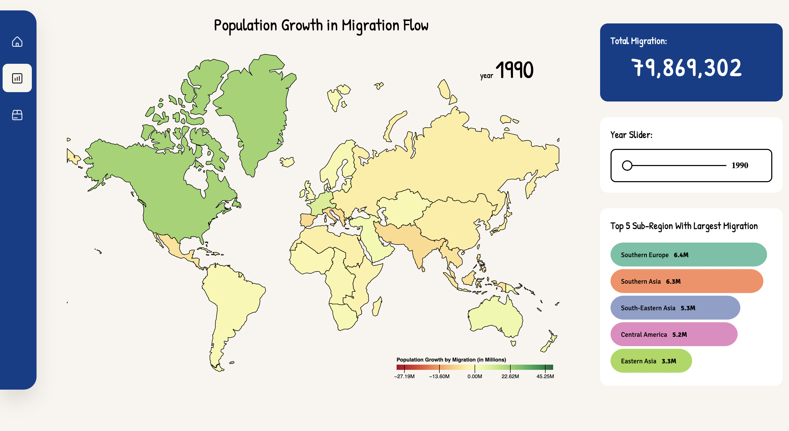
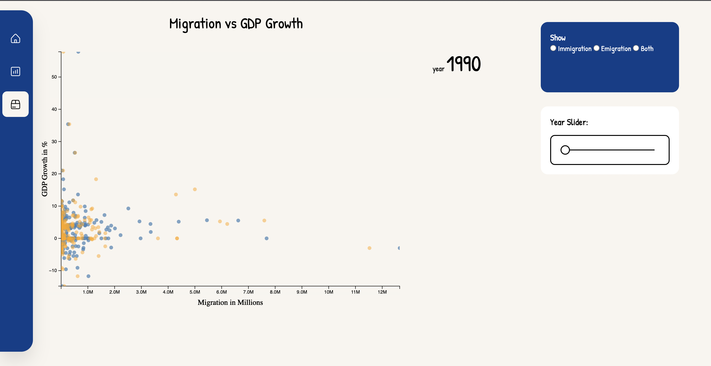

# Migration Data Visualisation
## About the Project
Each year, the number of people migrating increases gradually. Migration can take various forms, including temporary or permanent, voluntary or forced, and it can have substantial social, economic, and political consequences for both the areas people are leaving and the destinations they choose.

A comprehensive dataset from the [UN Migration](https://www.un.org/development/desa/pd/data/international-migration-flows) is available, covering migration trends from 1990 to 2020. This project aims to analyze this extensive dataset and present two data visualizations. These visualizations will effectively convey the patterns of migration in each region over the specified period and shed light on its impact on GDP growth.

Features:
* Migration flow diagram: this visualisation shows the net migration flow level (inflow and outflow) from each region.
* Scatter plot diagram: this visualisation shows the relationship between net migration and GDP growth between each country.

LIVE PROJECT: [Live](https://davidangga.github.io/migration-data-visualisation/index.html)

NOTE: the website is not mobile-responsive.

## Built With
* 
* 
* 

## Installation
* clone repo
  ```sh
  git clone [URL]
  ```
## Usage and App ScreenShots
### Migration Flow

### Scatter Plot

## License

Distributed under the MIT License. See `LICENSE.txt` for more information.
